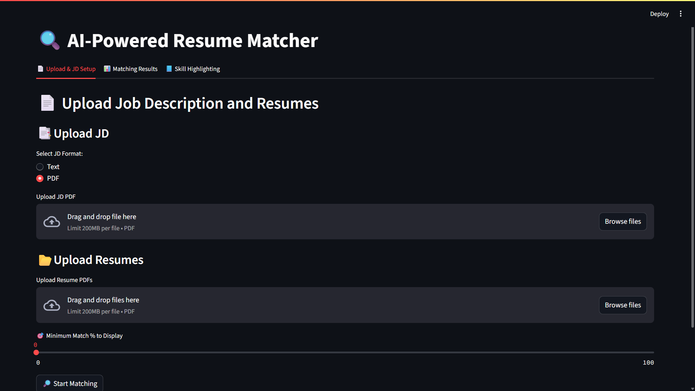
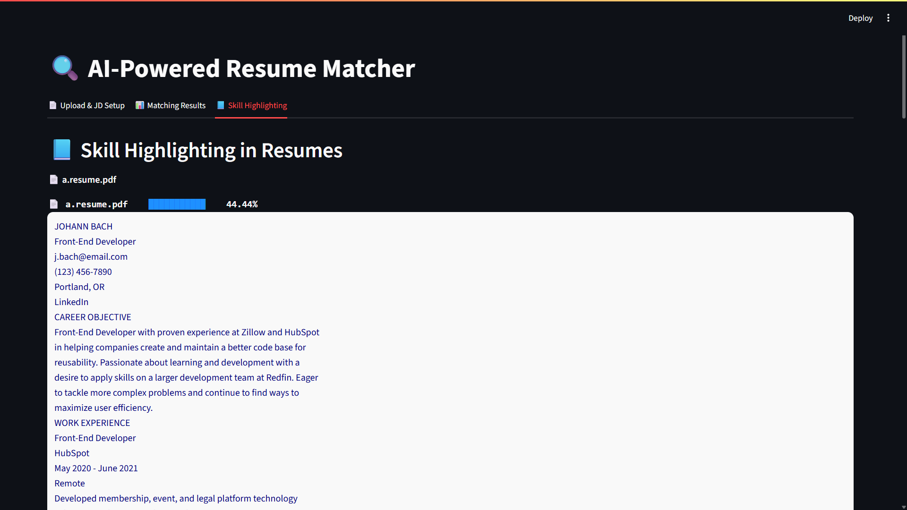

# 📄 AI-Powered Resume Screener  

An **AI-powered resume screening tool** built with **Python + Streamlit**.  
It helps recruiters & HRs to automatically **match resumes with a Job Description (JD)** and rank candidates based on skill match percentage.  

---

## 🚀 Features
- ✅ Upload **Job Description (JD)** → NLP extracts required skills  
- ✅ Upload multiple **Resumes (PDFs)** → Text parsing & skill extraction  
- ✅ **Skill Matching** → Highlights matched ✅ & missing ❌ skills in each resume  
- ✅ **Match % Calculation** → Ranks candidates by compatibility  
- ✅ **Filter & Sorting** → By match percentage  
- ✅ **CSV Export** → Download results in CSV format  
- ✅ **Modern UI** → Tab-based clean interface with animations 🎉  

---

## 🛠️ Tech Stack
- **Python**  
- **Streamlit** (UI Framework)  
- **NLP (Spacy/Regex)** for skill extraction  
- **Pandas** for data handling  
- **PyPDF2 / pdfminer.six** for resume parsing  

---

## 🎯 Use Case
- HRs / Recruiters → Quickly shortlist resumes based on job requirements  
- Students → Check how well their resume matches a JD before applying  

---

## 📌 Future Enhancements
- Semantic resume parsing using **AI embeddings** (beyond keywords)  
- Cloud Deployment on **Streamlit Cloud / Render**  
- Candidate search & advanced filtering  
- Analytics dashboard (charts & graphs)  

---

## 📷 Demo Screenshot
Here is a preview of the AI Powered Resume-Screener: 





---

## ⚡ How to Run Locally
```bash
# Clone the repo
git clone https://github.com/aryankumar-931/AI-Powered-Resume-Screener.git
cd AI-Powered-Resume-Screener

# Install dependencies
pip install -r requirements.txt

# Run Streamlit app
streamlit run app.py
